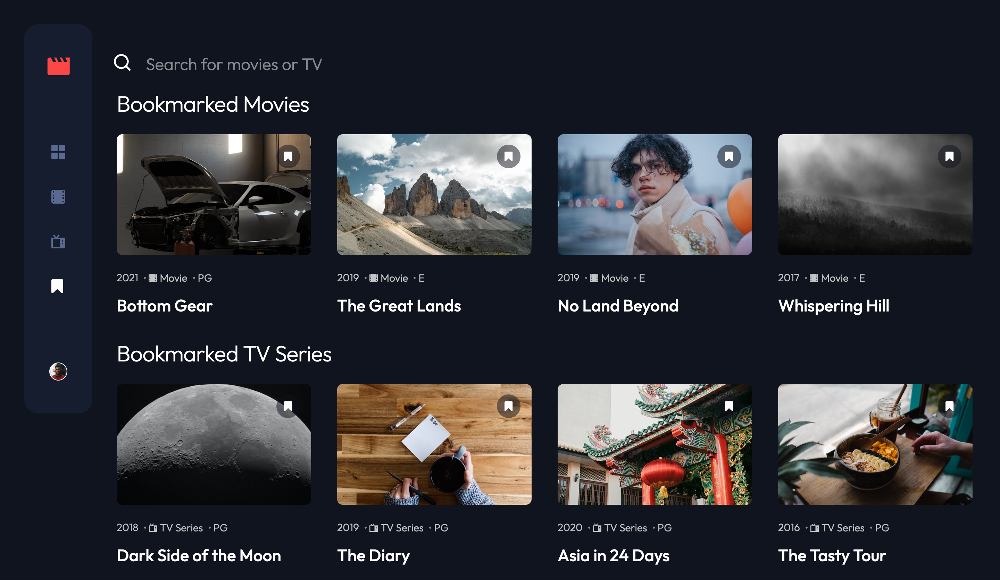
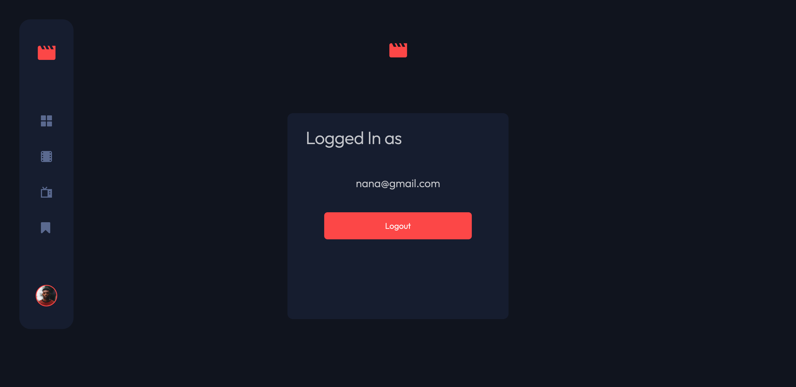

# Entertainment web app

[](https://opensource.org/licenses/Apache-2.0)

## Table of contents

- [Overview](#overview)
  - [The challenge](#the-challenge)
  - [Screenshot](#screenshot)
  - [Links](#links)
- [My process](#my-process)
  - [Tutorial](#tutorial)
  - [Built with](#built-with)
  - [Continued development](#continued-development)
- [Author](#author)

## Overview

### The challenge

Users should be able to:

- Built as a full-stack application
- View the optimal layout for the app depending on their device's screen size
- See hover states for all interactive elements on the page
- Navigate between Home, Movies, TV Series, and Bookmarked Shows pages
- Add/Remove bookmarks from all movies and TV series
- Search for relevant shows on all pages
- Register/Login to an account to be able to bookmark their favorite movie or TV series

### Screenshot




### Links

- Solution URL: [https://github.com/12Ricky0/entertainment-web-app.git](https://github.com/12Ricky0/entertainment-web-app.git)
- Live Site URL: [https://entertainment-web-app-6i77.vercel.app/](https://entertainment-web-app-6i77.vercel.app/)

## My process

### Tutorial:

1. **Clone the Repository**
2. **Navigate to the Project Directory**
3. **Install Dependencies**
4. **Run the Tests**
5. **Run the app as a container**

### Detailed Example

To run tests, follow these steps:

```bash
git clone https://github.com/12Ricky0/entertainment-web-app.git
```

```bash
cd entertainment-web-app
```

```bash
npm install
```

```bash
npm test
```

```bash
docker compose up
```

### Example Test Output

> your-project-name@1.0.0 test /path/to/your/project
> mocha

Your Project Tests
✓ should pass this test
✓ should pass another test

2 passing (100ms)

### Built with

- Semantic HTML5 markup
- CSS custom properties
- Flexbox
- CSS Grid
- MongoDB
- Mongoose
- Mobile-first workflow
- [React](https://reactjs.org/) - JS library

### Continued development

- MERN Stack: Build more advanced projects as a full stack so I can easily integrate the backend whe the frontend.
- React Router: Explore the various aspects of the react router.

## Author

- Frontend Mentor - [@12Ricky0](https://www.frontendmentor.io/profile/12Ricky0)
- Instagram - [@temple4b](https://www.instagram.com/temple4b)

```

```
